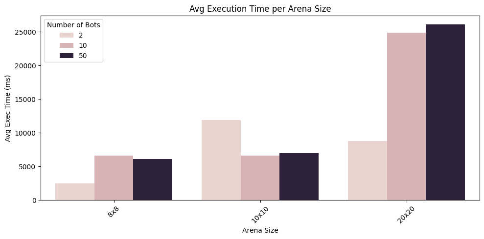
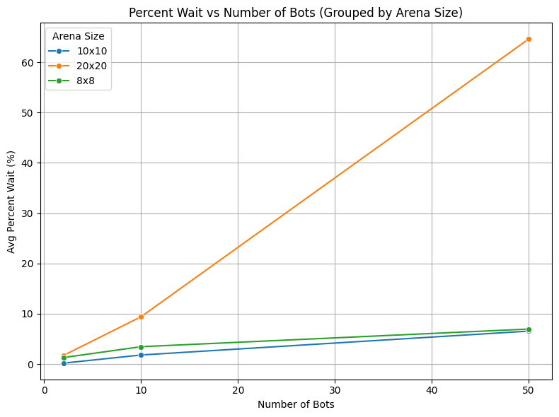
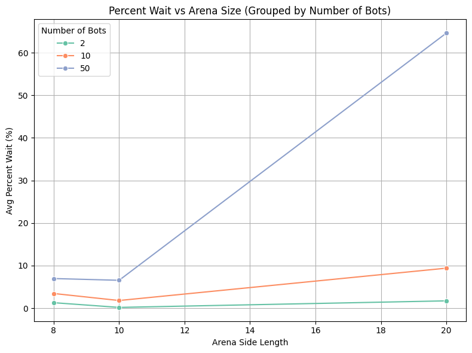

# Multithreaded Bot Arena

## Overview

This is the repository of **Multithreaded Bot Arena**, a parallel programming project implemented in C++. This project simulates a dynamic, grid-based battle arena where multiple autonomous bots compete in real time. Each bot operates independently using a dedicated thread, allowing for concurrent decision-making and interactions within a shared environment.

The arena serves as the central battleground where bots move, gather items, and engage in battles with one another. Bots follow predefined strategies based on RPG-style archetypes like **Warrior**, **Mage**, **Tank**, and **Archer**, each with unique behavior rules and stat presets.

The project demonstrates the use of **multithreading**, **mutex-based synchronization**, and **shared resource management** to model concurrent agents in a game-like simulation. It highlights practical challenges in parallel programming such as:

- **Thread safety** when accessing shared data (the arena)
- **Race conditions** during combat or item collection
- **Coordination** between the main thread and individual bot threads

The simulation is visually represented via a console interface, enhanced with **colored logs** for easy tracking of bot actions, item usage, and battles.

## Project Structure

This project is organized around three main components:

1. [**Arena**](arena.cpp) – The shared grid-based environment where all interactions occur.
2. [**Bot**](bot.cpp)  – Independent entities with distinct strategies and attributes, each running on its own thread.
3. [**Item**](item.cpp)  – Collectible resources that provide stat boosts to bots and influence gameplay.

---

## Item Class

The [item.cpp](item.cpp) file defines collectible objects that bots can use to gain an advantage in the arena. There are currently two item types implemented:

- **Health Potion**: Restores 30 health points to a bot, up to a maximum of 100.
- **Weapon Add-on**: Permanently increases a bot’s attack power by 10, also capped at 100.

To use an item, a bot must be on the same tile as the item. If a bot is already dead, it cannot use items. The logic for using each item includes status checks and outputs color-coded logs indicating whether the action was successful.

Item usage is handled through dedicated `use()` methods in the `HealthItem` and `WeaponItem` classes. These methods attempt to apply the effect (healing or boosting attack) and then log the result to the console. The logs help with debugging and following bot behavior during the simulation.

Items are **periodically spawned by the main thread**, adding an element of unpredictability and encouraging bots to make strategic movement decisions. In future versions, more item types (e.g., speed boosters, shields, timed buffs) could be added to enrich the gameplay.

## Bot Class

The [bot.cpp](bot.cpp) file defines the core behavior and properties of bots in the arena. Each bot is a distinct entity with stats and a strategy, and runs in its own thread to allow parallel execution.

### Bot Attributes

Each bot is defined by the following attributes:
- **ID and Name** – Unique identifiers.
- **Position (`x`, `y`)** – The current location of the bot on the arena grid.
- **Health** – Current health, initialized from the `BotHealth` enum (Strong: 100, Normal: 75, Weak: 50).
- **Attack Power** – Damage potential, set via `BotAttackPower` enum (High: 35, Medium: 25, Low: 15).
- **Defense Power** – Reduces incoming damage, set using `BotDefensePower` enum (High: 10, Medium: 5, Low: 2).
- **Speed** – Number of tiles the bot can move in one turn, determined by the `BotSpeed` enum (Normal: 1, Fast: 2, Fly: 3).

The values were designed so that even the highest defense never exceeds the lowest attack, ensuring that damage is always possible and avoiding infinite loops during combat.

### Core Abilities

Bots support a variety of actions:
- **`takeDamage`** – Reduces health based on incoming attack and defense.
- **`heal`** – Restores health unless the bot is already dead or at max health.
- **`increaseAttackPower`** – Increases attack power up to a cap of 100.
- **`decideMove`** – Computes the bot’s next move based on its archetype strategy.

### Archetypes and Strategies

There are four predefined bot archetypes inspired by classic RPG roles. These are implemented as classes that inherit from the base `Bot` class and override the movement logic:

- **Warrior** – Aggressive archetype that always moves toward the nearest enemy. Ignores items unless encountered along the way.
- **Mage** – Adapts based on health:
  - Moves toward a health potion if health < 15 (and a potion is available).
  - Heals in place for +10 if health < 30.
  - Otherwise, hunts the nearest enemy.
- **Tank** – Prioritizes survivability:
  - If health < 40 and a weapon is available, moves to collect it.
  - Otherwise, seeks out the weakest enemy.
- **Archer** – Tactical and agile:
  - Moves toward a health potion if health < 15.
  - Increases attack power by +5 while staying in place if health < 20.
  - Otherwise, chases the nearest enemy.

Details of each archetype’s attributes can be seen in the table below:

| Archetype | Health  | Attack Power | Defense | Speed  |
|-----------|---------|--------------|---------|--------|
| Warrior   | Normal  | High         | Medium  | Normal |
| Mage      | Weak    | Medium       | Low     | Fly    |
| Tank      | Strong  | Low          | High    | Normal |
| Archer    | Normal  | Medium       | Medium  | Fast   |

Each archetype defines its `decideMove` behavior by querying the arena state (e.g., enemy positions, item locations) and calculating movement based on distance and speed, optionally applying movement reduction logic to avoid overlap.

These strategies create varied and emergent gameplay as bots react differently to health status, proximity to threats, and resource availability.

## Arena Class

The [arena.cpp](arena.cpp) file is the central controller of the simulation. It encapsulates all core components — bots, items, and their interactions — and manages the shared grid-based environment where everything takes place.

The arena maintains:
- The **dimensions** of the grid (`width` and `height`)
- A map of **bot positions** and pointers to the corresponding bots
- A map of **item positions** and pointers to the corresponding items
- A list of all active bots (for easy thread access)
- A **mutex** to synchronize access to shared data

---

### Arena Function Categories

The Arena class provides functionality grouped into three main categories:

#### 1. Utility Functions
These help bots make strategic decisions by analyzing the game state:
- ``getNearestEnemy`` – Finds the closest opposing bot.
- ``getWeakestEnemy`` – Identifies the bot with the lowest health.
- ``getNearestItem`` – Locates the closest item of a specific type (e.g., health or weapon).
- ``checkBattles`` – Returns a list of adjacent enemy positions a bot could engage with.

These functions are frequently used within bot strategies to decide movement and actions.

#### 2. State Functions
These functions are responsible for maintaining and displaying the current state of the arena:
- ``displayArena`` – Visually prints the arena grid with markers for bots and items. Bots are shown with their index (e.g., `B0`), items with a single character, and both if overlapping.
- ``isGameOver`` – Returns `true` if only one bot remains, signaling the end of the match.
- ``spawnItem`` – Attempts to add a new item at a specified location (if unoccupied), and logs success/failure.

#### 3. Bot Control Functions
These functions handle the logic for bot actions:
- ``moveBot`` – Uses the bot’s strategy to determine and execute movement. It prevents illegal moves (e.g., out of bounds or into another bot).
- ``checkAndCollectItem`` – Checks if a bot is on an item and triggers item usage logic if so.
- ``battle`` – Handles combat logic between two bots, applying damage and checking for defeat.
- ``runBot`` – The main thread function each bot runs. It randomly alternates between movement and battling, while continuously checking for death and game-over conditions.

---

### Initialization and Thread Management

At startup, the arena is initialized with a given number of bots and items. Bot positions and archetypes are assigned randomly, as are item types and locations.

The main thread:
- Initializes the arena
- Launches a thread for each bot
- Periodically spawns new items
- Waits for all threads to complete (using `join`)
- Displays the final arena state

Colored logs are used throughout the system to help trace game events, such as movements, item usage, battles, and bot elimination. This provides a readable and informative simulation trace in the terminal.

## Timed Mutex and Performance Tracking

To evaluate how the simulation behaves under different configurations, we implemented a custom timing utility in [`timedMutex.cpp`](timedMutex.cpp). This module wraps around a standard mutex and tracks how long each thread waits to acquire the lock. It records:

- Per-thread wait times
- Total accumulated waiting time
- Fine-grained timing using `std::chrono`

These measurements help us understand the impact of **arena size** and **number of bots** on **thread contention** and **resource access efficiency**.

All execution statistics were logged and saved in [`threadTimes.txt`](threadTimes.txt). The table below summarizes the **average execution time**, **wait time**, and **percent of time spent waiting** for different configurations:

| Arena Size | Number of Bots | Avg Exec Time (ms) | Avg Wait Time (ms) | Avg Percent Wait (%) |
|------------|----------------|--------------------|---------------------|-----------------------|
| 10x10      | 2              | 11920.00           | 20.00               | 0.17                  |
| 10x10      | 10             | 6591.80            | 91.00               | 1.79                  |
| 10x10      | 50             | 6936.18            | 374.16              | 6.54                  |
| 20x20      | 2              | 8807.00            | 149.00              | 1.71                  |
| 20x20      | 10             | 24853.10           | 1820.70             | 9.39                  |
| 20x20      | 50             | 26088.40           | 14759.90            | 64.62                 |
| 8x8        | 2              | 2497.50            | 32.00               | 1.28                  |
| 8x8        | 10             | 6611.10            | 143.20              | 3.44                  |
| 8x8        | 50             | 6087.50            | 192.90              | 6.95                  |

---

## Performance Insights

To further analyze these results, we generated visualizations that show how execution and wait times scale under different conditions. The graphs below reveal patterns in contention, efficiency, and resource utilization:

1. **Average Execution Time per Arena Size**
   
   

2. **Percent Wait vs Number of Bots (Grouped by Arena Size)**

   

3. **Percent Wait vs Arena Size (Grouped by Number of Bots)**

   

